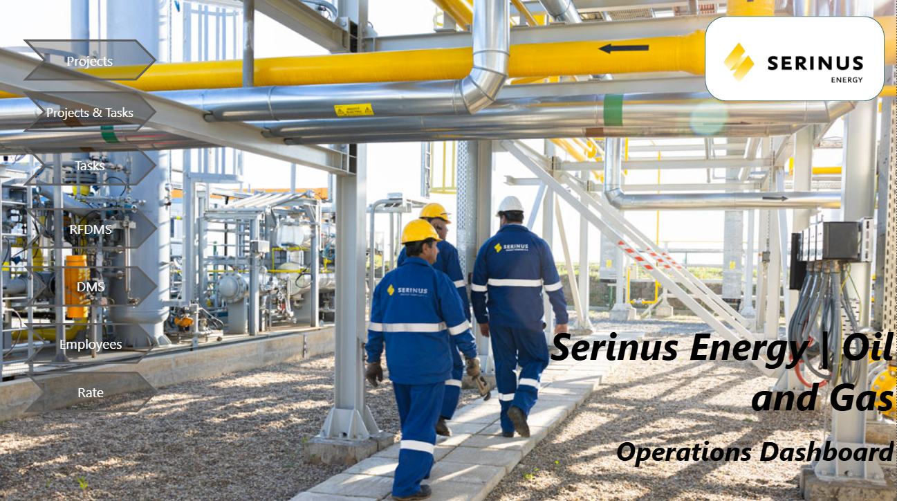
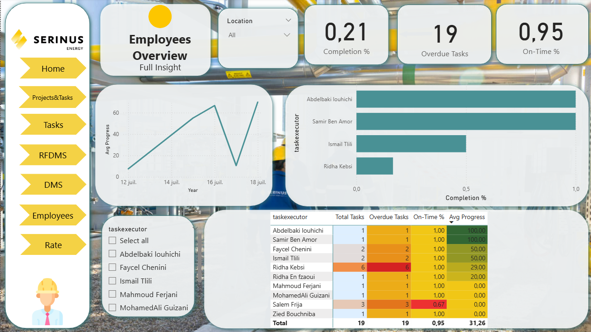
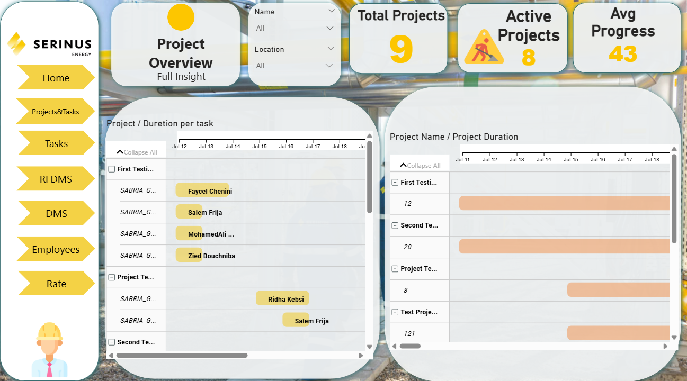

# 📊 Serinus Energy Oil & Gas Operations Analysis - Power BI Dashboard

## 📊 Project Overview

This Power BI project analyzes operational data for Serinus Energy, an international oil and gas company with onshore assets in Romania and Tunisia. The dashboard enables dynamic filtering and offers interactive visuals to track KPIs, production trends, concession performance, and regional contributions for informed decision-making.

---
## 📎 Screenshots

### Dashboard - Home Page


### Dashboard - Employees Review


### Dashboard - Project Overview


## 📁 Dashboard Features

### 🔍 Filter Panel
- **Date Range Selector**: Adjustable slider to analyze data by time period.
- **Region, Concession, Asset Type**: Dropdown filters to refine insights by geographic and operational attributes.
- **Employee/Team Selector**: Filter to analyze performance by team or individual contributors.

---

## 📈 Key Metrics & Visuals

### ✅ KPI Cards
- **Total Production**: [Insert Value, e.g., 358M Barrels]
- **Active Concessions**: [Insert Value, e.g., 6]
- **Average Daily Output**: [Insert Value, e.g., 5K Barrels]
- **Top Producing Field**: [Insert Value, e.g., Sabria]

### 📦 Production Breakdown
- **Production by Concession**: Compares performance across assets like Satu Mare (Romania) and Sabria (Tunisia).
- **Total Output by Date**: Time-series visual showing trends across months/years.
- **Output by Region and Category**: Bar chart showing contributions from Romania and Tunisia segmented by oil/gas.
- **Output by Location**: Geospatial map powered by Microsoft Bing showing asset distribution.

---

## 👥 Operations and Performance

- **Production by Asset Type**: Breakdown for onshore fields in Romania (e.g., Moftinu) and Tunisia (e.g., Chouech Es Saida).
- **Top Performing Concessions**: Highlights like Sabria with 358M barrels in place.
- **Employee Performance**: Insights into team or individual contributions to operational efficiency (see Employees Review dashboard).
- **Yearly Growth by Field**: Line graph tracking annual production growth for all concessions.

---

## 🛠️ Tools & Technologies
- **Power BI Desktop**
- **DAX for Measures & Calculations**
- **Power Query for Data Transformation**
- **Microsoft Bing & OpenStreetMap Integration for Geospatial Analysis**

---

## 📌 Usage Instructions
1. Clone or download this repository:
   ```bash
   git clone https://github.com/[YourGitHubUsername]/SerinusEnergy-Dashboards.git
   ```
2. Open the `.pbix` file in Power BI Desktop.
3. Use the slicers (date, region, concession, employee, etc.) to explore specific operational segments.
4. Review KPIs and charts to identify production drivers and optimization opportunities.

---
## 📌 Author

Made with ❤️ by [Farah]